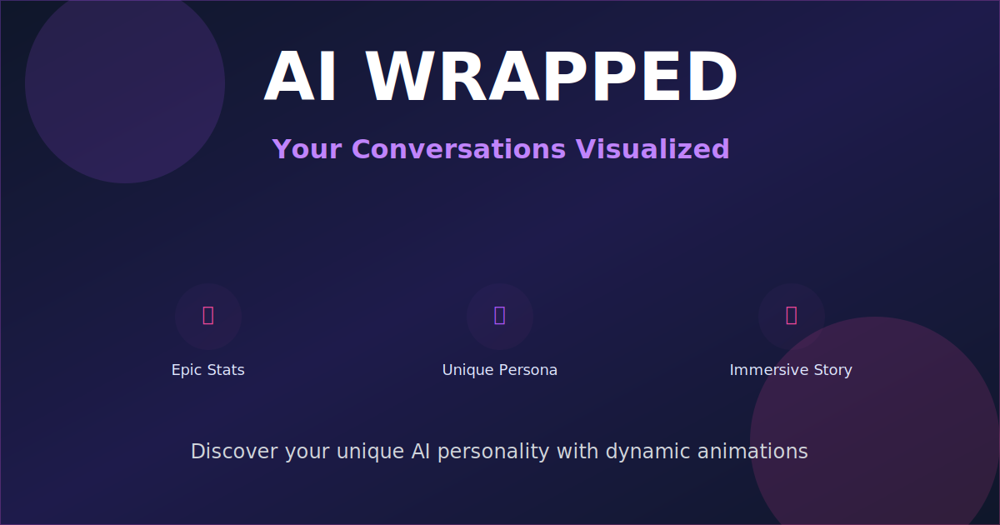

# 🎭 AI Wrapped

Discover your unique AI personality! **AI Wrapped** is an interactive web app that analyzes your conversation history with ChatGPT or Claude and generates a personalized, immersive story with dynamic animations, epic stats, and your unique persona.

## Features

✨ **Dynamic Persona Generation** - Every AI call generates a completely unique persona description using the Groq API. No two wraps are the same!

📊 **Epic Analytics** - Beautiful visualizations of your chat statistics:
  - Total messages exchanged
  - Busiest day of the week
  - Most active hour
  - Monthly activity trends
  - Your longest streak
  - Deep dive insights

🎨 **Immersive Story Experience** - Each story step has a unique:
  - Dynamic gradient background (pink, purple, blue, teal, orange, etc.)
  - Custom animations (glow, shimmer, float, pulse)
  - Mood-based theming (bright, energetic, calm, epic, dark)

🔒 **Privacy First** - All processing happens in your browser. Your chat data never leaves your device.

📱 **Share Anywhere** - Generate shareable links with encoded analytics. Perfect for Discord, Twitter, or any social platform with beautiful OG previews.

## Privacy & Data

All chat processing happens locally in your browser. The only data sent to Groq servers is the anonymized conversation summary for persona generation. Raw chat messages are never sent to any external service.

## Contributing

Have ideas? Found a bug? Feel free to open an issue or submit a PR!

## License

MIT
